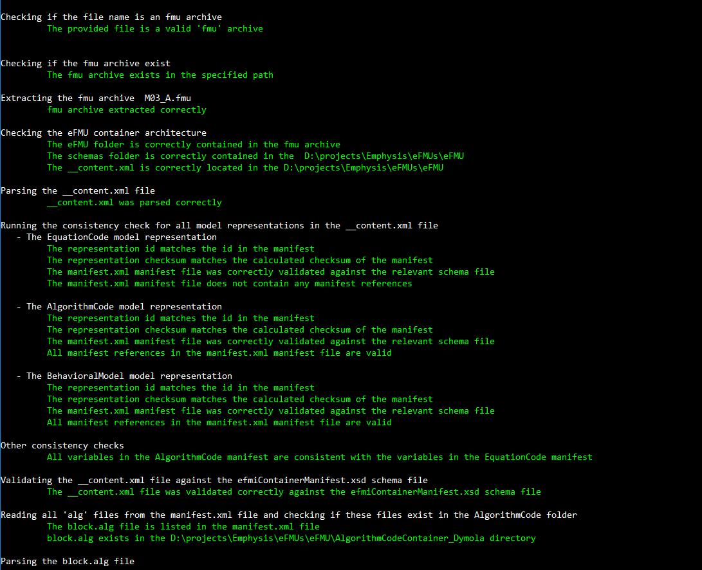

# Repository overview

This repository provides the source code of the _eFMI Compliance Checker_, a tool for checking eFMUs for conformance with the [eFMI Standard](https://efmi-standard.org).

The supported checks are:

- Verifying the eFMU container architecture (e.g., are all containers listed in the eFMU manifest)
- Consistency checking of all model representation manifests, which includes:
1- Checking if the representation id matches the id in the manifest file
2- Comparing the representation checksum with the calculated checksum of the manifest file
3- Validating the representation manifest against the relevant schema file
4- Validating inter and intra manifest references (referenced id exists and its checksum) 
- Validating the GALEC code against the specification, which includes:
1- parsing the GALEC code and extracting all variables and functions
2- Checking if the declared variables match the manifest variables of its Algorithm Code container
3- Validating all expressions by checking if all variables are declared and their types are correct

A full list of supported checks is given in the [AsciiDoc](https://asciidoc-py.github.io/) file [documentation/validation_list.adoc](documentation/validation_list.adoc).

For implementation details of the supported checks cf. the [implementation documentation](documentation/implementation.md).

## Dependencies

The _eFMI Compliance Checker_ is a [Python](https://www.python.org/) library; to use it, an installed [Python 3.10.0](https://www.python.org/) or higher runtime environment is required.

The _eFMI Compliance Checker_ uses the following Python libraries besides the [Python Standard Library](https://docs.python.org/3/library/index.html):
 * [Lark](https://lark-parser.readthedocs.io/en/latest/) for parsing
 * [lxml](https://lxml.de/) for processing XML and HTML
 * [colorama](https://pypi.org/project/colorama/) for colored terminal text and cursor positioning
 * [NumPy](https://numpy.org/) for large, multi-dimensional arrays and matrices and operations on such

## User interface

The following example shows how to run the _eFMI Compliance Checker_ to validate an eFMU called `M14_A.fmu`:

```
py <<path-to-main>>\main.py <<path-to-eFMU>>\M14_A.fmu
```

The `<<path-to-main>>` is the path to the `complianceChecker/main.py`.

**IMPORTANT:** Checking an eFMU requires it to be unpacked temporarily; the current work directory is used to that end. Always call the _eFMI Compliance Checker_ from a work directory where the temporary `eFMU` folder of the eFMU can be safely created!

The check results will be printed on the terminal. For a correct eFMU, you will have results like:



## Contributing, security and repository policies

Please consult the [contributing guidelines](CONTRIBUTING.md) for details on how to report issues and contribute to the repository.

For security issues, please consult the [security guidelines](SECURITY.md).

General MAP eFMI repository setup and configuration policies are summarized in the [MAP eFMI repository policies](https://github.com/modelica/efmi-organization/wiki/Repositories#public-repository-policies) (only relevant for repository administrators and therefor private webpage).
